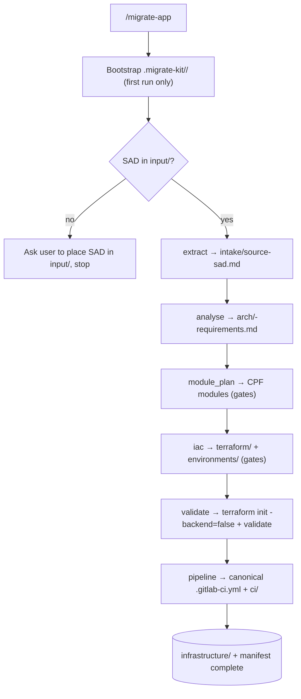

# MigrateKit — Architecture

MigrateKit is a **thin orchestration layer** distributed as an APM package. It
drives an application's Azure LMP migration from a **SAD document only**, reusing
`IaC_Terraform_Agent_4LMP` for all migration substance.

## Responsibility boundary

MigrateKit **owns**: folder creation, SAD placement, phase sequencing, path
mapping, manifest updates, canonical pipeline reshaping, and running Terraform
validation.

MigrateKit **delegates** (never re-implements): SAD extraction, SAD analysis, CPF
module mapping, Terraform generation, and GitLab CI generation — all to
`IaC_Terraform_Agent_4LMP`.

Out of scope in this version: AI Migrate intake, `/assess`.

## Components

| Component | File | Role |
|---|---|---|
| Orchestrator agent | `.apm/agents/migrate-kit.agent.md` | Guided, resumable flow + rules |
| `/migrate-app` | `.apm/prompts/migrate-app.prompt.md` | Bootstrap + SAD placement + sequencing |
| Granular commands | `.apm/prompts/*.prompt.md` | One per delegated phase |
| Workflow contract | `.apm/instructions/workflow.instructions.md` | Folders, phases, manifest, gates, idempotency |
| Pipeline format | `.apm/instructions/pipeline-format.instructions.md` | Canonical two-tier GitLab CI |
| Templates | `.apm/templates/*` | Manifest + pipeline skeletons |

## Phase pipeline

## State & handoff

`migration.manifest.yaml` is the single source of truth. Each phase records its
status, artifacts, the current `sad_source`, the `next_step`, and `updated`.
Resume reads the manifest and continues from the first incomplete / blocked phase.
`--rerun <phase>` re-runs one completed phase in place.

## Decision gates

The IaC toolkit's human gates are preserved and surfaced verbatim:
new-vs-migration, CPF version review (A/B/C), Artifactory-vs-GitLab registry, and
mono/multi/micro topology. MigrateKit pauses; it never auto-answers.

## Install-time safety

An installed APM package must not mutate the workspace during installation.
MigrateKit scaffolds folders and writes artifacts **only** when the user runs
`/migrate-app`.

## Distribution

Packaged and installed via APM (`apm install <org>/migrate-kit`); the
`IaC_Terraform_Agent_4LMP` dependency resolves transitively. Commands surface as
slash-commands in VS Code Copilot Chat after install.
